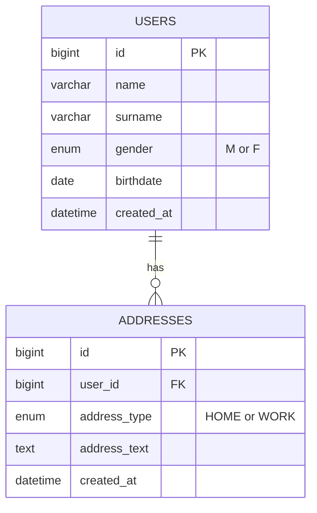

# UserHub

A full-stack user management web application. Users can be registered with personal details and addresses, browsed in a searchable and sortable list, and deleted with a confirmation prompt. Clicking on a user opens their full details in a new tab.

---

## Features

- **Register User** — Form with name, surname, gender (M/F), birthdate (JS datepicker), and optional home/work address
- **Users List** — Sortable columns, global search filter, and pagination (5 / 10 / 20 / 50 rows per page, preference saved in browser)
- **User Detail** — Full user info and addresses, opens in a new browser tab
- **Delete User** — Delete with a confirmation modal
- **Validation** — Both client-side (frontend) and server-side (backend) validation on all required fields

---

## Tech Stack

| Layer | Technology |
|---|---|
| **Frontend** | React 19, React Router v7, TanStack React Table v8, React DatePicker, Axios, Vite, Tailwind CSS |
| **Backend** | Spring Boot 3.5, Java 21, Spring Data JPA / Hibernate, Spring Validation, Maven |
| **Database** | MySQL 8.0 |
| **DevOps** | Docker, Docker Compose |

---

## Database Schema



---

## API Endpoints

| Method | Endpoint | Description |
|--------|----------|-------------|
| `GET` | `/api/users` | Get all users (summary list) |
| `GET` | `/api/users/{id}` | Get full details of a user |
| `POST` | `/api/users` | Register a new user |
| `DELETE` | `/api/users/{id}` | Delete a user |

---
## Known Limitations & Trade-offs

- **No Authentication or Authorization** — There is no login, JWT, or role-based access control. In a real application, JWT tokens would be used and stored securely on the client side (e.g. via Redux Toolkit) to protect API endpoints and restrict access based on user roles.

- **No API Versioning** — All endpoints are unversioned (e.g. `/api/users` instead of `/api/v1/users`). Versioning would be essential in production to allow backward-compatible API evolution.

- **No Rate Limiting** — No throttling or rate limiting is applied to any endpoint. A production service would use rate limiting to prevent abuse and protect server resources.

- **No Caching** — No caching layer (e.g. Spring Cache, Redis) is implemented. Given the small dataset and project scope, caching was not necessary here.

- **No Update User Feature** — Only create, read, and delete operations are supported. Adding an update feature would also require a concurrency strategy (e.g. optimistic locking with `@Version`) to handle simultaneous edits.

- **Hibernate Auto-DDL for Schema Management** — The database schema is generated automatically by Hibernate (`ddl-auto`). This is acceptable for a development project but would be replaced by a migration tool like Flyway or Liquibase in production.

- **`show-sql: true` Enabled** — SQL logging is turned on for development convenience. In a production environment, this should be disabled or routed to a proper logging framework to avoid excessive log output.

- **No Server-Side Pagination** — All users are fetched in a single query. This works for a small dataset, but for a large-scale application, server-side pagination would be necessary to avoid loading too much data into memory. Client-side pagination is handled using TanStack React Table.

- **No Logging Framework Configuration** — The project relies on Spring Boot's default logging. A production application would configure a logging framework (e.g. Logback with structured output) with appropriate log levels and log file management.

- **Hard Delete Only** — Deleting a user permanently removes the record from the database. Soft delete (using flags like `deleted_at` or `updated_at`) was intentionally not implemented to keep the schema simple. Only a `created_at` timestamp is tracked.

- **Limited Test Coverage** — The project does not include integration tests or extensive unit tests. In a production codebase, thorough test coverage would be expected. For integration test i should add a mock database like m2 and repository design pattern helps in that case.


## Running with Docker

> **No local MySQL installation required.** Docker Compose spins up the database automatically as a container.

### Prerequisites

- [Docker Desktop](https://www.docker.com/products/docker-desktop) installed and running

### 1. Create a `.env` file

Create a file named `.env` in the **root of the project** (same folder as `docker-compose.yml`) with the following content:

```env
DB_NAME=userhub
DB_USERNAME=admin
DB_PASSWORD=mysecretpassword
```

> You can choose any values you like for these three variables. They will be used to create the MySQL database and the user that connects to it.

### 2. Start the application

```bash
docker compose up --build
```

This will build and start all three services (database, backend, frontend). The first run may take a few minutes.

### 3. Access the application

| Service | URL |
|---------|-----|
| Frontend | http://localhost:5173 |
| Backend API | http://localhost:8080/api |
| MySQL (host) | localhost:3307 |

### Stop the application

```bash
docker compose down
```

To also delete the database volume (all stored data):

```bash
docker compose down -v
```
